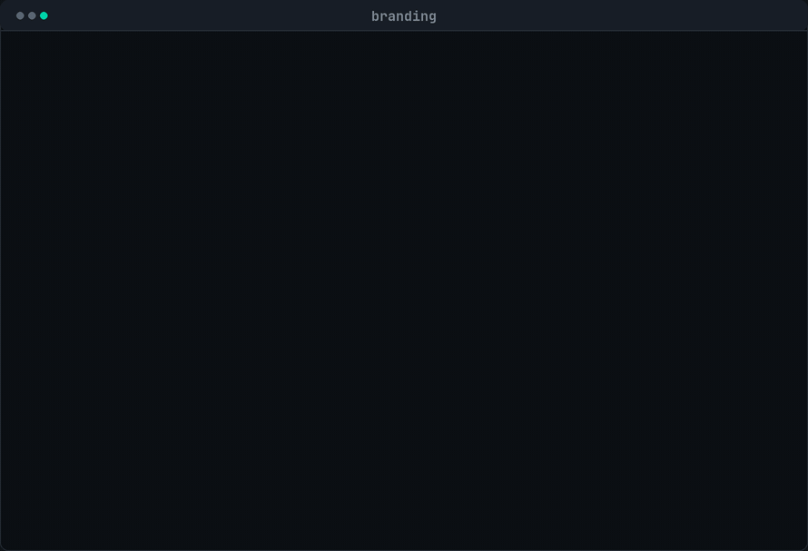
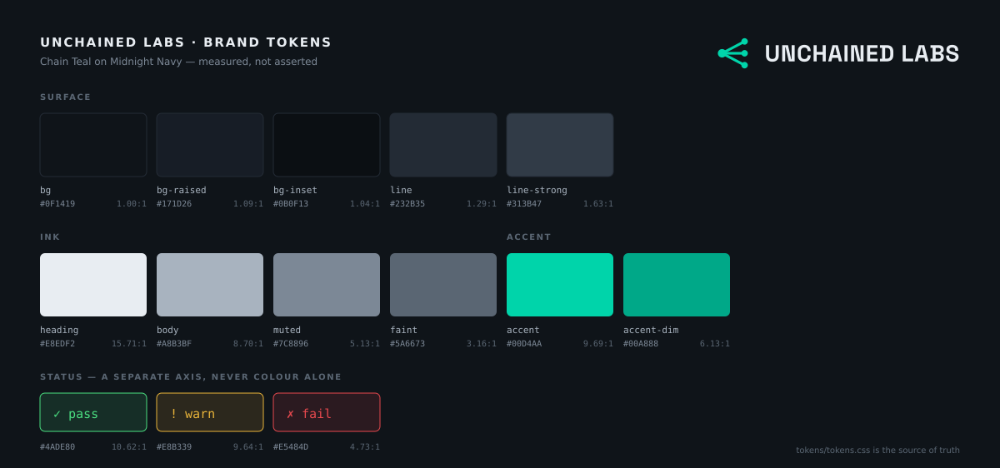

<div align="center">
  
  <p><strong>Brand system for Unchained Labs</strong><br>
  <sub>the single source of truth for colour, mark, type and voice</sub></p>
  <p><a href="https://unchained-labs.github.io/branding/">unchained-labs.github.io/branding</a></p>
</div>

<div align="center">
  
  <br><sub>The docs are tested against measurement. <a href="https://unchained-labs.github.io/branding/">Full docs →</a></sub>
</div>

---

The palette, mark and type used across
[graphlint](https://github.com/Unchained-Labs/graphlint),
[decorrelate](https://github.com/Unchained-Labs/decorrelate),
[preflight](https://github.com/Unchained-Labs/preflight),
[authsweep](https://github.com/Unchained-Labs/authsweep),
[workflow-hub](https://github.com/Unchained-Labs/workflow-hub),
[Kymatics](https://github.com/Unchained-Labs/kymatics),
[Otter](https://github.com/Unchained-Labs/otter),
[Seal](https://github.com/Unchained-Labs/seal) and
[Lavoix](https://github.com/Unchained-Labs/lavoix).

**If an app's colours drift from this repo, this repo wins.**



## Current brand

**Chain Teal on Midnight Navy.** Neither colour is new — both were already the
palette of `unchainlabs.xyz` and of the four Kymatics services. What this repo
added is a measured ink ramp, a status axis that does not collide with the brand,
a documented mono face, and tooling that fails CI when any of it drifts.

| Role | Token | Value | Contrast |
| :--- | :--- | :--- | ---: |
| Ground | `--ul-bg` | `#0F1419` | — |
| Raised surface | `--ul-bg-raised` | `#171D26` | 1.09:1 |
| Hairline | `--ul-line` | `#232B35` | 1.29:1 |
| Heading | `--ul-heading` | `#E8EDF2` | 15.71:1 |
| Body | `--ul-body` | `#A8B3BF` | 8.70:1 |
| Muted | `--ul-muted` | `#7C8896` | 5.13:1 |
| Accent | `--ul-accent` | `#00D4AA` | 9.69:1 |

Status is a **separate axis** and never decorative — `--ul-up` `#4ADE80`,
`--ul-warn` `#E8B339`, `--ul-down` `#E5484D`. These products exist to answer
*did it pass?*, so that answer never shares a colour with the brand.

That separation is imperfect and the imperfection is documented rather than
hidden: Chain Teal sits at hue 168°, status-pass at 142° — only 26° apart. The
mitigation is a hard rule that **status is never encoded in colour alone**; every
pass/warn/fail carries a glyph or a word. Full reasoning, the four rejected
palette directions, and every measured ratio in
[`brand/palette.md`](brand/palette.md) and
[`research/palette-study.md`](research/palette-study.md).

## Mark

A **fan-out** — one heavy node, three edges, three light nodes. The thesis of
every tool here is that linear execution is a chain and the real work is a graph,
so the mark is the shape that replaces the chain rather than a broken version of
it. Read as a glyph it is a `<`.

The geometry is computed, not drawn: [`tools/mkmark.py`](tools/mkmark.py) solves
each edge's endpoints onto the node circumference so no stroke pokes through at
any size. Nine candidates were rendered at five sizes on both grounds before this
one won; the shortlist and the rejects are in
[`research/mark-options.md`](research/mark-options.md).

The lockups contain **no `<text>` elements and no font references** — the wordmark
is real outline paths derived from the vendored Space Grotesk, so it renders
identically on a machine that has never heard of the font.

Construction, sizing, clear space and misuse in [`brand/logo.md`](brand/logo.md).

## Type

| Role | Family |
| :--- | :--- |
| Display | Space Grotesk 600–700 |
| Label | Space Grotesk 600, uppercase, `+0.08em` |
| Body | Inter 400–500 |
| Data | JetBrains Mono 400–500 |

Space Grotesk and Inter are inherited from the existing site. The mono is new,
and it is load-bearing: these products report measurements, and a figure set in
the mono face reads as *output* while the same figure in Inter reads as a
*claim*. Reasoning in [`brand/typography.md`](brand/typography.md).

## Contents

```
brand/
├── palette.md        the ramp, the accent budget, the status collision
├── typography.md     four roles, the scale, why data gets its own face
├── logo.md           the mark — construction, sizing, misuse
└── voice.md          how the writing sounds
research/
├── palette-study.md  five directions considered, and why four lost
└── mark-options.md   nine candidates, the shortlist, the rejects
tokens/
├── tokens.css        CSS custom properties — THE SOURCE OF TRUTH
├── tokens.json       design-token JSON, with measured ratios (generated)
└── tailwind.css      Tailwind v4 @theme block (generated)
assets/
├── logo/             SVG marks + lockups, and png/ (generated)
└── palette/          the hero image above (generated)
fonts/                Space Grotesk variable + OFL
site/                 the shared stylesheet every Unchained Labs Pages site uses
tools/                generators and verifiers — see `make help`
```

## Using it

Drop [`tokens/tokens.css`](tokens/tokens.css) in and style through the custom
properties. **Never hard-code a hex in an app repo** — the accent legitimately
changes value between light and dark mode (`#00D4AA` is 1.91:1 on white and
unreadable as text), so a hard-coded teal is a light-mode bug waiting to ship.

For a docs or landing page, [`site/brand.css`](site/brand.css) is the stylesheet
behind every Unchained Labs Pages site. Copy it in; it depends only on
`tokens.css`.

## Verifying it

Everything asserted in this repo is checked:

```sh
make check          # tokens + docs consistency (no container needed)
make contrast       # print every documented pair and its measured ratio
make verify-docs    # every ratio written in the docs matches measurement
make verify         # every PNG is the size and ink its filename claims
make all            # full rebuild from source
```

`make verify-docs` exists because the ratios in `brand/palette.md` were wrong
twice while this repo was being written — estimated by eye, then stated in a table
as if measured. A brand doc that asserts a wrong ratio is worse than one that
asserts none, because the wrong one gets trusted. So the docs are tested now, and
`make check` runs in CI on every push.

## Licence

Tokens, tooling and documentation are [MIT](LICENSE). The Unchained Labs name,
wordmark and mark are **not** covered by that licence — see
[`TRADEMARK.md`](TRADEMARK.md). Space Grotesk is under the SIL Open Font License
([`fonts/OFL-SpaceGrotesk.txt`](fonts/OFL-SpaceGrotesk.txt)).

## Relationship to the sibling brands

Erwin Lejeune also owns [Clanker-Labs](https://github.com/Clanker-Labs/branding)
(amber, "Porchlight") and [HoopsLab](https://github.com/HoopsLab/brand). These are
**siblings, not children**: same token vocabulary and repo layout, deliberately no
shared surface colour. Chain Teal at 168° and Porchlight amber at 30° are 138°
apart, on opposite sides of the warm/cool line. A component moves between the
systems by swapping the token file and nothing else.
